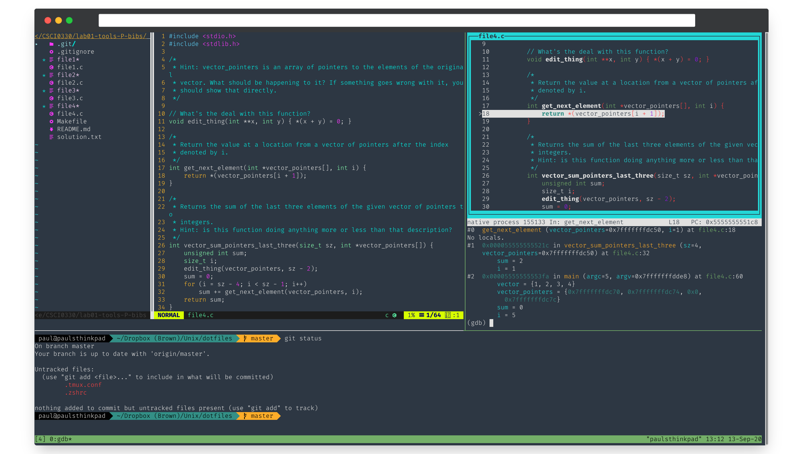

# Dotfiles

<p align="center">

</p>

## Required Packages

- oh-my-zsh
  - `sh -c "$(curl -fsSL https://raw.github.com/ohmyzsh/ohmyzsh/master/tools/install.sh)"`
- Packages
  - `sudo pacman -S neovim tmux ripgrep the_silver_searcher`
  - `yay -S git-delta-bin spotify dropbox nerd-fonts-fira-code gtk-theme-solarc-git`
- `vim-plug`
  - ```
    sh -c 'curl -fLo "${XDG_DATA_HOME:-$HOME/.local/share}"/nvim/site/autoload/plug.vim --create-dirs \
       https://raw.githubusercontent.com/junegunn/vim-plug/master/plug.vim'
    ```
- Gogh (Gnome Terminal Themes)
  - Install Misterioso for dark theme and Google Light for light theme
  - `bash -c "$(wget -qO- https://git.io/vQgMr)"`

## AUR packages

## Create symlinks

```bash
cd ~
DIR=path/to/this/directory
ln -s $DIR/.zshrc ~/.zshrc
ln -s $DIR/.tmux.conf ~/.tmux.conf
ln -s $DIR/init.vim ~/.config/nvim/init.vim
ln -s $DIR/Snippets ~/Documents/Snippets
```

## Install neovim plugins

```bash
# execute this within neovim
:PlugInstall
```

## VSCode snippets
```bash
ln -s $DIR/snippets ~/.config/Code/user/snippets
```
